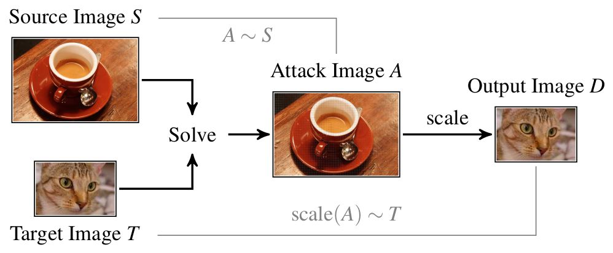

# AI Scaling Attacks
This repo is based off the the original repository: https://github.com/EQuiw/2019-scalingattack

All research and original repository was created by the below group.

---

Erwin Quiring, David Klein, Daniel Arp, Martin Johns and Konrad Rieck.
Adversarial Preprocessing: Understanding and Preventing Image-Scaling Attacks in Machine Learning.
*Proc. of USENIX Security Symposium*, 2020.

---

## Background
For an introduction together with current works on this topic, please visit
our [website](http://scaling-attacks.net).

<p align="center">

</p>

In short, image-scaling attacks enable an adversary to manipulate images, such
that they change their appearance/content after downscaling. In
particular, the attack generates an image A by slightly
perturbing the source image S, such that its scaled version D
matches a target image T. This process is illustrated in the figure above.

## Getting Started
This repository contains the main code for the attacks and defenses. It has a
simple API and can be easily used for own projects. The whole project consists
of python code (and some cython additions).

The `create_image.py` is a custom script based off of the Juptyer notebook found in `./scaleatt/tutorial/jupyter_intro.ipynb` which will allow you to specify two images and an algorithm to create your own malicious scaling images. For more information please see the [README](./scaleatt/README.md). 

The original 2019-scaleattack code has been updated to work with Python 3.10.

### Installation
In short, you just need the following steps (assuming you have Anaconda).

Get the repository:
```
git clone https://github.com/EQuiw/2019-scalingattack
cd 2019-scalingattack/scaleatt
```
Create a python environment (to keep your system clean):
```
conda create --name scaling-attack python=3.10
conda activate scaling-attack
```
Install python packages and compile cython extensions:
```
pip install -r requirements.txt
python setup.py build_ext --inplace
```

Check the [README](./scaleatt/README.md) in the scaleatt directory for a
detailed introduction how to set up the project (in case of problems). The README will also explain in detail each command line argument for `create_image.py`.

That's it. Now you can run the create_image.py script to create your own scaling images.
```
PYTHON PATH=$(pwd) python create_image.py -s <SOURCE IMAGE> -t <TARGET IMAGE> -l <LIBRARY> -a <ALGORITHM> -c <SCALING> -o <OUTPUT IMAGE>
```

If you would like to know more information about each command line argument in create_image.py use the `-h` flag

# scaleatt/scalingOutput
This directory holds various test images using the three algorithms at 4 different scaling values: 20, 40, 60, 80. 